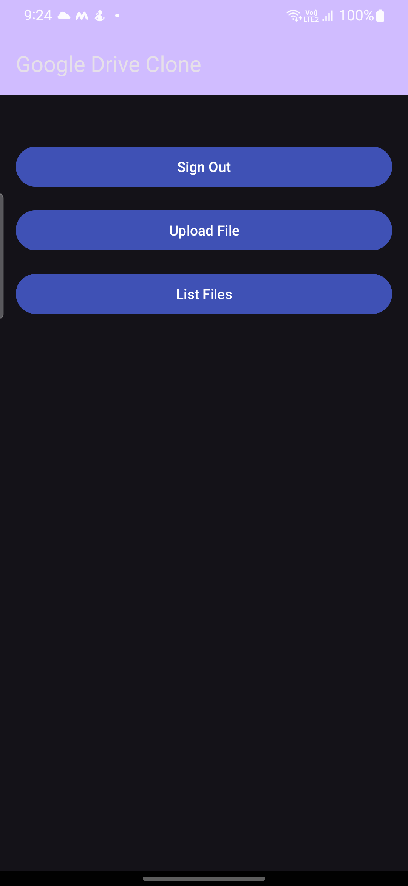

# Google Drive Clone

Google Drive Clone is an Android application that allows users to authenticate using Google Sign-In, access their Google Drive, upload files, list files, preview, and download files.

---

## Features

- **Google Sign-In:** Implemented Google Sign-In functionality for user authentication.
- **Authorization:** Authorization flow for accessing Google Drive.
- **Google Drive File Upload:** Allows users to upload files to Google Drive.
- **File Listing Screen:** Displays a list of files from the user's Google Drive.
- **File Preview and Download:** Users can preview or download files from the list.

---

## Screenshots

  

 

---

## Getting Started

### Prerequisites

- Android Studio
- Google Developer Console API Key
- Google Drive API Credentials

### Installation

1. Clone the repository.
2. Open the project in Android Studio.
3. Add your Google Developer Console API key to `google-services.json`.
4. Add your Google Drive API credentials to `google-services.json`.
5. Build and run the project.

---
Happy coding! 🚀

